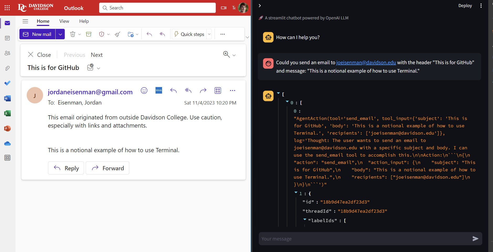
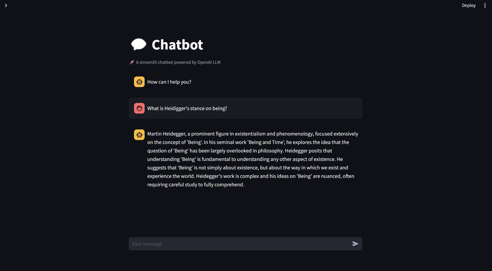

# 🖥️ Terminal 🖥️

Terminal is a new take on an old idea. Terminals have existed since time immemorial. Terminals of old make you type in exact commands. 😡 What frustrates us is that our computers interpret our commands too literally. Software does exactly what we tell it to do. This is frustrating. 😤

## Project Overview

This project implements a new kind of terminal, one which does not necessarily do what we say but do what we mean. More specifically, I build a chatbot with access to software integrations. Thus far, I have connected my chatbot with my Gmail, so it is capable of mining through my email, sending messages, and responding -- without me ever having to go into my email. Hypothetically, I could integrate this with my LinkedIn, Instagram, Facebook, Calendar, or any other application to this chatbot. Pretty awesome, no? 😎

If this sounds abstract, think about how Siri can interact with an iPhone. Similar concept! 📱

**Disclaimer:** I cannot host this website for everyone to use, since it is connected to my Firebase and Gmail accounts. ❗

## Project Features

### MVP (Minimum Viable Product)

I wanted this project to represent an MVP, a minimum viable product. My MVP is a chatbot user interface that is able to respond normally to humans and also able to use functions. Here are two examples of different questions:

 📷

In the first image, I ask the chatbot to send an email to my school email. The array tells me what was sent. To the left, you can see the email that was actually delivered. This chatbot, however, does not inherently use functions. In the second image, you can see the image respond normally to my philosophical question, given that the question is unrelated to any of my functions.

 📷

## Implementation

1. **User Interface:** I used a template from [Streamlit](https://streamlit.io/generative-ai). I used this format in particular, though there are plenty of similar examples! 🌐

2. **Model:** GPT models are overrated -- there, I said it. Building the model, I used a framework called LangChain to create "agents." Agents do stuff -- look through databases, scroll through the internet, troll on Twitter, etcetera. What is special about LangChain is that it allows language models to guide agents. Here's how it works -- buckle up! Langchain allows you to chain together language functions. In Terminal, you ask the chatbot a question. The Langchain chatbot uses an LLM to interpret the question. The model thinks, determining how it may answer the question. The model then uses the thought to see if it has any functions associated with the thought. That is, can it search Google, look through a database? The model retrieves relevant information from these resources. Using the retrieved information and the chatbot's reasoning, it outputs a response.

**Example:** I might ask: "have I gotten emails from Tesla in the past week?" The chatbot interprets the question. It thinks it will have to look through my email. The agent finds a function to parse my emails. The agent puts in the right parameters, giving the correct timeframe. This function outputs a list of emails and their contents. The chatbot uses Python to find the emails sent from Tesla. The chatbot then responds to the original question. 💡

## Thank You! 🙌📚

Thanks for reading! 🙌📚
